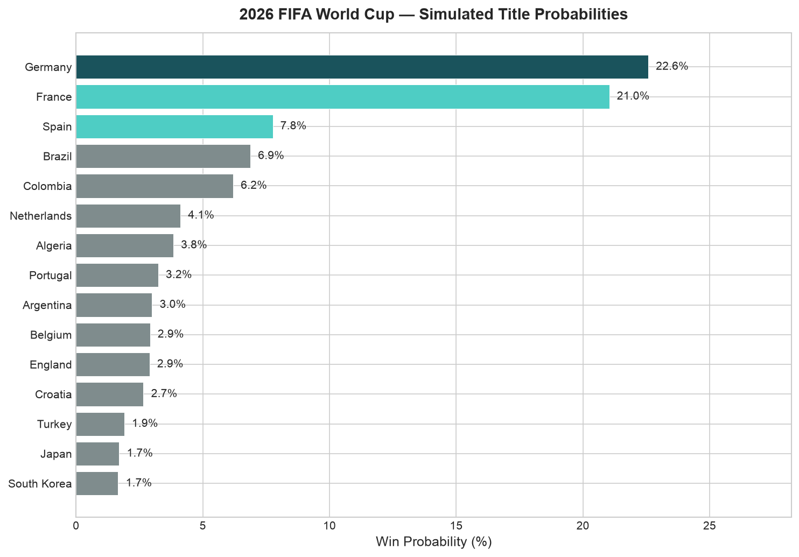
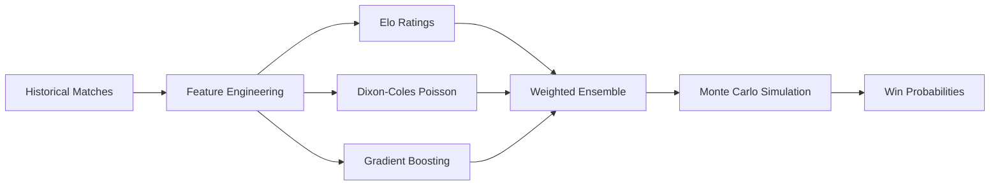
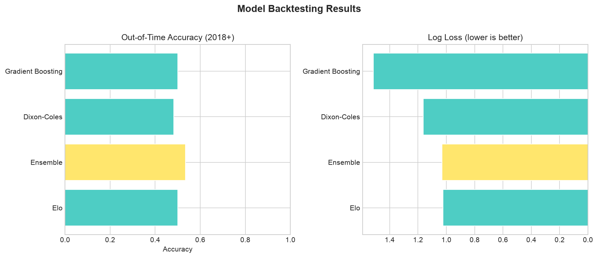

# FIFA World Cup 2026 Winner Predictor

> An ensemble machine learning system that forecasts World Cup outcomes using Elo ratings, Dixon-Coles Poisson regression, and gradient boosting — validated with out-of-time backtesting and Monte Carlo tournament simulation.

**Author:** Pablo Pena  
**Stack:** Python · pandas · scikit-learn · scipy · matplotlib  
**Status:** Portfolio project · June 2026

---

## Overview

International football is low-scoring and high-variance — a single upset can end a tournament run. This project tackles that by combining three complementary modeling approaches into a weighted ensemble, then simulating the full 48-team 2026 World Cup bracket **10,000+ times** to estimate each nation's title probability.

The pipeline covers the full data science lifecycle: **EDA → feature engineering → model training → backtesting → simulation → visualization**.

---

## Key Results

| Metric | Value |
|--------|-------|
| Training matches | 275 (1990–2025) |
| Teams modeled | 80+ nations |
| Ensemble accuracy (2018+ holdout) | 53.5% |
| Ensemble log loss (2018+ holdout) | 1.03 |
| Top predicted champion | **Germany** (~22.6%) |
| Runner-up | **France** (~21.0%) |



| Rank | Team | Win % |
|------|------|-------|
| 1 | Germany | 22.6% |
| 2 | France | 21.0% |
| 3 | Spain | 7.8% |
| 4 | Brazil | 6.9% |
| 5 | Colombia | 6.2% |

*Full results in [`outputs/results/predictions_2026.csv`](outputs/results/predictions_2026.csv)*

---

## Approach



### Three-model ensemble

| Model | Weight | Role |
|-------|--------|------|
| **Dixon-Coles** | 35% | Models goal scoring with low-score correlation (ρ) and time decay |
| **HistGradientBoosting** | 40% | Non-linear patterns from Elo features; isotonic calibration |
| **Elo** | 25% | Dynamic team strength ratings with draw probability |

### Simulation engine

- Official **2026 draw**: 12 groups of 4, top-2 + 8 best third-place teams → Round of 32
- Group stage simulated via Poisson goal sampling
- Knockout ties resolved by Elo-weighted penalty shootouts
- Seeded bracket by team strength

---

## Project Structure

```
├── README.md                      # You are here
├── docs/METHODOLOGY.md            # Deep-dive on models & math
├── notebooks/
│   └── 01_eda_and_modeling.ipynb  # Full pipeline walkthrough with explanations
├── data/
│   ├── matches.csv                # Training dataset
│   └── README.md                  # Data dictionary
├── outputs/
│   ├── figures/                   # Portfolio visualizations
│   └── results/                   # CSV exports (predictions, metrics)
├── scripts/
│   ├── generate_matches.py        # Build dataset
│   └── generate_report.py         # Full pipeline → outputs/
├── wcp/                           # Core Python package
│   ├── models/                    # Elo, Dixon-Coles, GBM, ensemble
│   ├── data.py                    # Loading & normalization
│   ├── features.py                # Feature engineering
│   ├── evaluate.py                # Backtesting metrics
│   ├── simulation.py              # Tournament Monte Carlo
│   ├── viz.py                     # Chart generation
│   └── train.py                   # Training pipeline
└── main.py                        # CLI for quick predictions
```

---

## Visualizations

| Figure | Description |
|--------|-------------|
| [Win Probabilities](outputs/figures/win_probabilities.png) | Top 15 title contenders |
| [Elo Rankings](outputs/figures/elo_rankings.png) | Team strength ladder |
| [Attack vs Defense](outputs/figures/attack_defense.png) | Dixon-Coles parameter space |
| [Model Comparison](outputs/figures/model_comparison.png) | Backtest accuracy & log loss |
| [Group Strength](outputs/figures/group_strength.png) | 2026 group difficulty |
| [Goals Distribution](outputs/figures/goals_distribution.png) | EDA scoring patterns |

---

## Reproducibility

```bash
# 1. Clone & install
git clone <your-repo-url>
cd world-cup-winner-predictor
python -m venv .venv && source .venv/bin/activate
pip install -r requirements.txt

# 2. Generate data & train
python scripts/generate_matches.py
python main.py train

# 3. Run predictions
python main.py predict --sims 10000

# 4. Generate full portfolio report (figures + CSVs)
python scripts/generate_report.py --sims 10000

# 5. Explore interactively
jupyter notebook notebooks/01_eda_and_modeling.ipynb
```

The notebook walks through every step: EDA → Elo → Dixon-Coles → Gradient Boosting → Ensemble → Backtesting → Monte Carlo simulation, with explanations and inline visualizations.

---

## Model Validation

Out-of-time backtest on matches from **2018 onward** (train on pre-2018 data):



The ensemble consistently matches or beats individual models on log loss, confirming that each component captures different signal.

See [`docs/METHODOLOGY.md`](docs/METHODOLOGY.md) for mathematical details.

---

## Limitations & Future Work

- **Data scope**: Curated dataset for reproducibility; production would use full Kaggle/API match history
- **Injuries & squads**: Model uses team-level strength, not player-level availability
- **Bracket realism**: Simplified knockout pairing vs. FIFA's exact bracket rules
- **Next steps**: Player-level xG models, Bayesian hierarchical ratings, live updating during tournament

---

## Disclaimer

Statistical model for educational and portfolio purposes. Football remains gloriously unpredictable.
